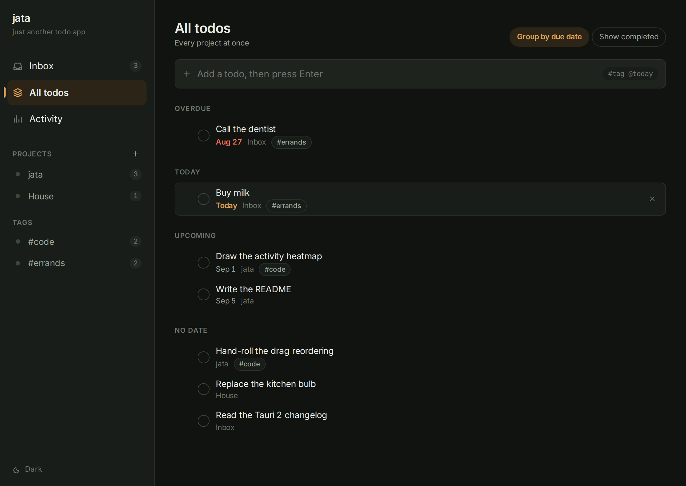
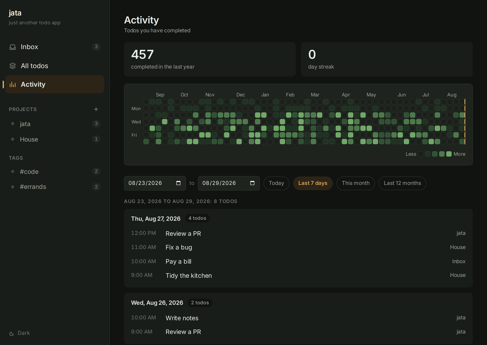

<p align="center">
  
</p>

<h1 align="center">jata</h1>

<p align="center">just another todo app</p>

<p align="center">
  A small, local-first desktop todo list with drag-to-reorder, projects, tags,
  and a GitHub-style activity graph of everything you have finished.
</p>

<p align="center">
  <a href="https://github.com/HeyTariq/jata/actions/workflows/ci.yml"></a>
  <a href="https://github.com/HeyTariq/jata/releases/latest"></a>
  <a href="LICENSE"></a>
</p>

Everything lives in one SQLite file on your machine. There is no account, no
sync, and no network access.

<p align="center">
  
  
</p>

## What it does

- **Lists and projects.** An always-present Inbox for quick capture, plus as
  many projects as you like. `#tags` cut across every project.
- **Drag to reorder.** Grab the handle on any row in a project view. Order is
  stored as a float position, so a drop writes one row instead of renumbering
  the list.
- **Activity graph.** A year of completions as a heatmap, exactly like the one
  you already know. Every check and un-check is recorded, so the squares always
  match what you actually did.
- **Look up a day or a range.** Click a square, or pick two dates, and see the
  todos you completed with the time you finished them. Entries keep a snapshot
  of the title, project, and tags, so history survives renaming a project or
  deleting the todo.
- **Due dates.** Optional per todo, with overdue and today highlighting and an
  optional grouped view.
- **Type to add.** On any list, just start typing. The first character lands in
  the quick-add box, so a todo is one keystroke away and nothing else is.
- **Light and dark.** Follows the system theme, with a manual override.

## Installing

Grab a build from the [releases page](https://github.com/HeyTariq/jata/releases/latest).

| Platform | File |
| --- | --- |
| Linux (Debian, Ubuntu) | `.deb` |
| Linux (Fedora, Nobara) | `.rpm` |
| Windows | `-setup.exe` |
| macOS, Apple Silicon | `_aarch64.dmg` |
| macOS, Intel | `_x64.dmg` |

The macOS and Windows bundles are not code signed, because signing them means
paying Apple and a certificate authority for the privilege. On macOS the first
launch needs a right-click and **Open** rather than a double-click. On Windows,
SmartScreen shows a warning: **More info**, then **Run anyway**.

## Quick add syntax

Type into the box at the top of any list:

```
Pay the water bill #home @tomorrow
```

- `#word` attaches a tag.
- `@today`, `@tomorrow`, a weekday name (`@friday`), an ISO date
  (`@2026-09-01`), or an offset in days (`@+3d`) sets a due date.

Anything that does not parse as a date is left in the title, so an email
address survives intact.

## Keyboard shortcuts

There are two, and neither of them fires by accident.

| Key | Action |
| --- | --- |
| `Ctrl+N` | New todo, from any view |
| `Ctrl+P` | New project |

On a list, typing any printable character focuses the quick-add box and keeps
that character, so most of the time you never reach for either one. `Escape`
cancels an inline edit or a drag; `Enter` saves.

## Where your data lives

One SQLite file named `jata.db` in the platform data directory:

| Platform | Path |
| --- | --- |
| Linux | `~/.local/share/dev.jata.app/jata.db` |
| macOS | `~/Library/Application Support/dev.jata.app/jata.db` |
| Windows | `%APPDATA%\dev.jata.app\jata.db` |

Back it up by copying that file while the app is closed.

## Building from source

You need [Node.js](https://nodejs.org) 22 or newer, [Rust](https://rustup.rs)
1.85 or newer, and the [Tauri v2 system
dependencies](https://v2.tauri.app/start/prerequisites/) for your platform
(webkit2gtk and friends on Linux).

```sh
npm install
npm run tauri dev      # desktop app with the real database
npm run tauri build    # release bundle in src-tauri/target/release
```

Bundle targets are deb and rpm on Linux. AppImage is left out because the
linuxdeploy release ships an old `strip` that chokes on libraries built with
`.relr.dyn` relocations (anything current on Fedora); add `"appimage"` to
`bundle.targets` in `src-tauri/tauri.conf.json` if your distro is happier with
it.

`npm run dev` on its own opens the UI in a browser against an in-memory mock of
the backend, which is handy for working on the frontend alone.

Tests for the data layer, ordering, and activity queries:

```sh
cd src-tauri && cargo test
```

## Contributing

Issues and pull requests are welcome. CI runs exactly these on every push and
pull request to `main`, so run them locally and it holds no surprises:

```sh
npm run build                                        # tsc --noEmit && vite build
cd src-tauri
cargo fmt --all --check
cargo clippy --all-targets --locked -- -D warnings
cargo test --locked
```

To report a security issue, see [SECURITY.md](SECURITY.md).

## Layout

```
src/                 frontend: dom helpers, store, views, drag-and-drop
src-tauri/src/
  db.rs              connection, pragmas, migrations
  store.rs           all queries: todos, ordering, tags, activity
  commands.rs        the Tauri command surface
  models.rs          serde types shared with the frontend
```

Rust owns everything that touches ordering or history, so it can be tested
without a browser. The frontend renders and handles input.

## License

[MIT](LICENSE).
